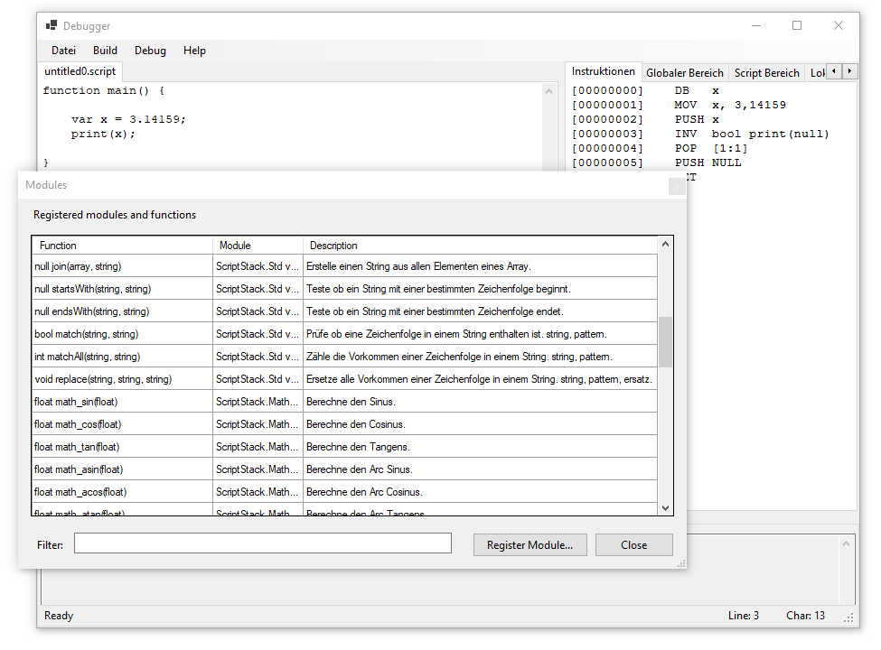

# StackShell

Create your own scripting language or extend a project with scripting capabilities.

To build one of the projects yourself download [ScriptStack](https://github.com/zarat/ScriptStack) or get it via [nuget.org](https://www.nuget.org/packages/ScriptStack/), add a reference to each project and build it. A tutorial is coming soon.

